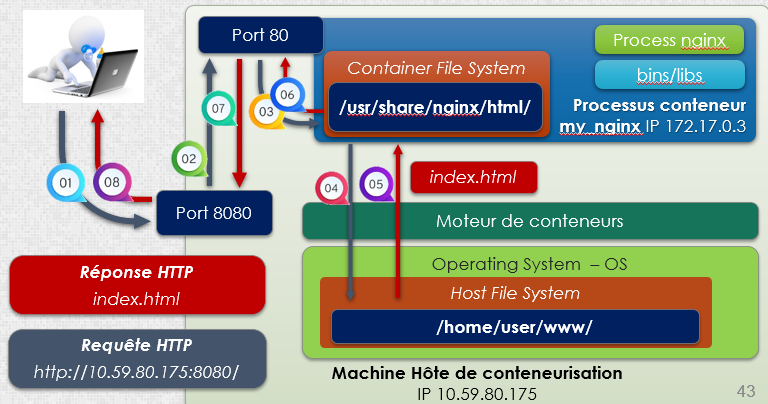

<p align="center">

</p>

# Aide memoire Docker

## Présentation

_**Docker** est un **logiciel libre** conçu pour lancer des applications dans des conteneurs logiciels. Ces conteneurs sont plus légers en ressources que les **machines virtuelles** car ils partagent leur noyau._

## Installation

#### **Ubuntu - via repo**
> Ancienne méthode, utile pour forcer la version :
```
$ apt-get install apt-transport-https ca-certificates curl gnupg-agent software-properties-common
$ curl -fsSL https://download.docker.com/linux/ubuntu/gpg | apt-key add -
$ apt-key fingerprint 0EBFCD88
$ add-apt-repository    "deb [arch=amd64] https://download.docker.com/linux/ubuntu $(lsb_release -cs) stable"
$ apt-get update
$ apt-get install docker-ce docker-ce-cli containerd.io
$ docker -v
```
#### **Vérifier l'installation**
```
$ sudo service docker start
$ sudo docker run hello-world
```

 _À ce stade seul root peut utiliser Docker. Il faut ajouter les utilisateurs qui doivent le lancer au groupe **"docker"** :_
```
$ sudo usermod -aG docker $USER
```
#### **Pour relancer Docker si besoin :**
```
sudo systemctl stop docker && sudo systemctl start docker
```

## Docker CLI
#### **Lister les conteneurs**
>Afficher les conteneurs actifs → la propriété « **status** » est à « **Up** »
```
$	sudo docker ps
```
>Afficher tous les conteneurs → même si la propriété « **status** » est 	à « **Exited** »
```
$ sudo docker ps -a
````
#### **Créer et lancer un conteneur**
```
$ sudo docker run -ti --name myalpine alpine:latest
```
* **docker run** → exécuter une commande dans un conteneur
* Option **-ti** → « **t** » pour ouverture d’un pseudo-terminal dans le conteneur
* « **i** » pour assurer l’interactivité
* **--rm** → supprimer le conteneur en le quittant
* **--name myalpine** → nommer le conteneur pour faciliter les opérations le concernant
* **alpine:latest** → s’appuyer sur une image d’un système alpine dernière version 

#### **Démarrer ou Arrêter un conteneur**
>Démarre le conteneur « **myalpine** »
```
$ sudo docker rm myalpine
```
>force la suppression du conteneur « **myalpine** » même s’il est **actif**
```
$ sudo docker rm -f myalpine
```
#### **Exécuter une commande dans un conteneur ouvert**
>ouvre un terminal s’appuyant sur l’interpréteur de commande « **sh** »
```
$ sudo docker exec -ti myalpine sh
```
#### **Visualiser les propriétés d’un conteneur**
>Affiche les propriétés du conteneur « **myalpine** » au format « **JSON** »
```
$ sudo docker inspect myalpine
```
#### **Quelques paramètres d’usage**
>Mapper le port d’écoute du conteneur sur un port de la machine hôte
```
-p portLocal:portContainer
````
>Monter dans un dossier du conteneur un dossier de la machine hôte
```
-v dossierLocal:dossierContainer
```
#### **Démarrer un conteneur docker nginx**
```
$ docker run -tid --rm -p 8080:80 -v /home/user/www:/usr/share/nginx/html --name r109-nginx nginx:latest
```
* Commande **docker run** → créer et lancer le conteneur
* Options **-tid** → lance un pseudo terminal interactif en arrière-plan
* Paramètre **--rm** → supprimer automatique un conteneur en le quittant
* Paramètre **-p 8080 :80** → mappe le « port 80 » du conteneur sur le « **port 8080** » de l’hôte
* Paramètre **-v /home/user/www:/usr/share/nginx/html** → monte le dossier 
« **/home/user/www** » de l’hôte dans le dossier « **/usr/share/nginx/html** » du conteneur. 
Permet d’enregistrer dans l’hôte les pages renvoyées par le serveur web du conteneur.
* Paramètre **--name r109-nginx** → nomme le conteneur « **r109-nginx** »
* Paramètre **nginx:latest** → utilise l’image la plus récente de « **nginx** »

#### **Tester le service depuis l’hôte**
>Ouvrir un **navigateur sur l’hôte** et utiliser **l’URL** vers **l’adresse IP locale du conteneur**. Par défaut, le navigateur interroge le **port 80** du conteneur, port système d’écoute des **requêtes HTTP**.

>Alternative, utiliser une **URL** pointant sur l’adresse IP de la machine hôte en précisant vers le port mappé **8080 de l’hôte** avec le **port 80 du conteneur** – **http://10.59.80.175:8080**. On peut aussi utiliser la **boucle locale** de l’hôte **http://127.0.0.1:8080**. 

>Le serveur « **nginx** » répond par une page **erreur utilisateur 403** en l’absence de page d’accueil (fichier « **index.html** » par défaut). Le serveur n’autorise pas l’affichage indexé du contenu du dossier. Il faut créer un page « index.html » dans le dossier partagé « **/home/user/www** »

#### **Tester le service depuis un hôte distant**
>Autoriser les requêtes http sur l’hôte qui exécute le conteneur en ouvrant le **port 8080**.

>Autorise les requêtes **TCP** qui arrivent sur le **port 8080**
```
$ sudo ufw allow 8080/tcp
```
>Recharge le **firewall**
```
$ sudo ufw reload
```
>Vérifier les **ports ouverts**
```
$ sudo ufw status 
``` 
>Utiliser un navigateur sur une machine Windows et envoyer une **requête http** vers le serveur hôte du conteneur sur son **port 8080** – **http://10.59.80.175:8080/**

#### **Exemple conteneur « nginx »**

