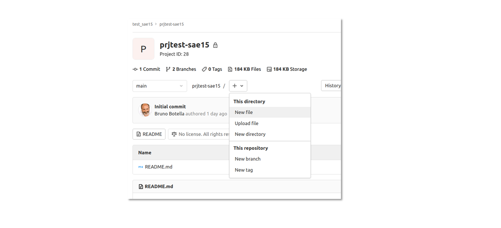

<p align="center">

</p>

# Aide memoire GitLab

## Présentation

_GitLab est un logiciel libre de forge basé sur git proposant les fonctionnalités de wiki, un système de suivi des bugs, l’intégration continue et la livraison continue._

## Mutualiser avec gitlab

* _Créer un compte sur le dépôt de l’IUT_
* _Dépôt local IUT-RT_
* _Se connecter au dépôt local IUT-RT_
* _Mettre à jour le profile utilisateur_
* _Ajouter une clé de signature SSH_
* _Créer la clé de signature SSH_
* _Importer la clé de signature SSH_

## Création du projet

### Creer un projet

<p align="center">

</p>

##### _**Créer un projet vide > Créer le projet**_

## Méthode de travail avec GitLab

* _Installer GitLab localement (Rappel sous linux)_
```
$ sudo apt-get install git
$ git config --global user.name "Mohamed Kevin"
$ git config --global user.email "mohamed.kevin@etudiant.univ-reims.fr" 
```
* _Configurer l’autorisation des certificats autogénérés_
```
$ git config --global http.sslverify false 
```
* _Activer un cache mémoire de 1h00 (3600 secondes) du mot de passe d’accès au compte distant_
```
$ git config --global credential.helper 'cache --timeout 3600' 
```
## Cloner le dépôt distant sur un dépôt local 
* _Récupérer l’URL du dépôt distant du projet_
<p align="center">

</p>

##### _**Projet > r115-tp2_soum0021 > Code > Cloner avec HTTPS**_
* _Copier le projet dans un dossier sur la machine locale_
    ##### _1 - Accéder au dossier du projet_
    ```
    $ cd ~/myworks/R115
    ```
    ##### _2 - Cloner localement le dépôt_
    ```
    $ git clone https://git.chalons.univ-reims.fr/soum0021/r115-tp2_soum0021.git
    ```
    ##### _3 - Accéder au dossier du dépôt local_
    ```
    $ cd ./r115-tp2_soum0021/
    ```
    ##### _4 - Vérifier la connexion avec le dépôt distant_
    ```
    $ git remote -v
    ```
## Modifier depuis le dépôt cloné 
* _S’assurer de disposer de la dernière version du projet_
```
$ git pull
```
* _Créer une nouvelle branche et commuter dessus_
```
$ git checkout -b newbranch
```
* _Tracer les modifications apportées localement 
Commandes « **git status** », « **git add** », « **git commit** »_

* _Pousser la branche vers le dépôt distant_
```
$ git push origin newbranch
```
* _Effectuer les « **merge requests** » pour demander la fusion des branches envoyées_
    ##### _1 - Champ « **Assignee** » -> compte qui a la responsabilité de la fusion_
    ##### _2 - Champ « **Reviewer** » -> comptes pour consultation_
    ##### _3 - Case à cocher « **Remove source branch when merge request is accepted** » -> supprimer la branche de modification fusionné_
    ##### _4 - Valider en cliquant sur « **Compare branches and continue** »_
    > Le titre correspond au message utilisé dans le commit d’origine
    
* _Répondre aux demandes de fusions pour les valider_

## Configurer l’exclusion de fichiers à pousser
* _Editer le fichier « **.gitignore** » à la racine du projet_
* _Fichier particulier à ignorer lors des « **git push** »_
    > Paquets des dépendances externes
    > Dossiers des sorties de build et fichiers compilées
    > Fichiers générés à l’exécution : fic.log, fic.lock, fic.tmp
    > Fichiers systèmes cachés
    > Fichiers de configurations personnels
* _Utiliser la génération automatique de « **.gitignore** »_

* _**Etape 1** -> Création d’un nouveau fichier_
<p align="center">

</p>

>**CLI** : 
```
$ touch ~/myworks/R115/r115-tp2_soum0021/.gitignore
``` 

* _**Etape 2** -> Choisir le type de fichier « **.gitignore** »_
<p align="center">

</p> 

* _**Etape 3** -> Nommer le fichier et appliquer un modèle en fonction du langage de développent_
<p align="center">

</p>

* _**Etape 4** -> Implémenter le fichier_
<p align="center">

</p>

* _**Etape 5** -> Terminer en ajoutant le message de commit dans le champ « **Commit message** »_
* _Valider avec le bouton « **Commit changes** »_
